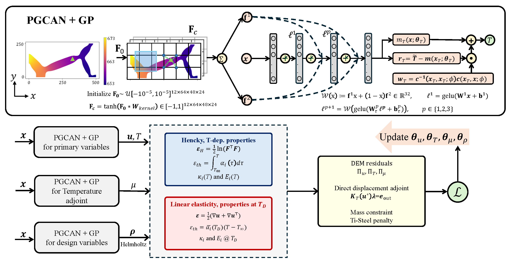

<div align="center">

# Linear Elasticity vs. Quadratic Hencky<br>in Multi-Material Thermo-Mechanical Topology Optimization

**Code and data accompanying the paper**

*On the Importance of Geometric Nonlinearity and Temperature-Dependent Properties<br>in Multi-Material Thermo-Mechanical Topology Optimization*

Shirin Hosseinmardi, Alex Sun, Ramin Bostanabad<br>


[](https://arxiv.org/abs/2608.10344)


[](LICENSE)


</div>

---

Thermo-mechanical compliant devices are usually designed with small-strain
linear elasticity and temperature-independent material properties, even though
they may operate hundreds of kelvin above ambient. This repository contains a
physics-informed, **simultaneous analysis-and-design** topology optimization
framework (**m-PIGP**) that quantifies the cost of each assumption: it
optimizes a thermal actuator and a thermal gripper over a
{void, Ti, Cu, Steel} material set under **both** a baseline physics model and
the full physics, subject to mass and manufacturability constraints.

<div align="center">


*Overview of the m-PIGP framework: PGCAN-parameterized GP priors represent the
primal fields (u, T), the temperature adjoint, and the design field; their
deep-energy residuals are combined with the direct displacement adjoint, the
mass constraint, and the Ti–Steel interface penalty into a single loss that is
minimized simultaneously over all parameters with Adam.*
</div>

## 🎯 The two physics models

| | Kinematics | Material properties |
|---|---|---|
| **Baseline** | small-strain linear elasticity | constant, anchored at the design temperature `TD` |
| **High-fidelity** | finite-strain quadratic Hencky (logarithmic strain) | temperature-dependent κ(T), α(T), E(T) fit to published measurements over 293–1100 K |

The quadratic-Hencky model uses a closed-form 2×2 log-strain
parameterization that stays finite and differentiable at coalescent
stretches, and its isotropic thermal eigenstrain admits an **exact additive
split** in log-strain space — so the two models share the same energy form and
differ *only* in kinematics. The design sensitivities come from a
sparse-direct (LDLᵀ) displacement adjoint with the full consistent tangent
and every property–temperature pathway carried through.

## 📂 Repository layout

```bash
.
├── Data/                       # Mesh and boundary-condition data (zipped .pt files)
├── assets/                     # Figures used in this README
├── evaluation/                 
│   ├── evaluate_actuator.ipynb # Verified-FE cross-evaluation of frozen actuator designs
│   └── evaluate_gripper.ipynb  # Verified-FE cross-evaluation of frozen gripper designs
├── models/                     
│   ├── gpregression.py         # Base GP regression model (builds on LVGP-PyTorch)
│   ├── lmgp.py                 # GP with PGCAN-parameterized mean
│   ├── pgcan.py                # PGCAN decoder networks (displacement / design heads)
│   └── pgcan_encoder.py        # PGCAN feature-grid encoder
├── tools/                      
│   └── visualize_run.py        # Figures & CSV exports for a finished run (creates eval inputs)
├── utils/                      
│   ├── lmgp_utils/             # Kernels, priors, likelihoods, transforms for the GPs
│   ├── get_training_data.py    # Loads mesh/BC data and builds GP conditioning sets
│   └── utils_general.py        # Seeding, device selection, misc helpers
├── environment.yml             # Exact conda environment used for the paper runs
├── run_actuator.py             # EX2D2 thermal actuator (paper Fig. 2a)
└── run_gripper.py              # EX2D1 thermal gripper (paper Fig. 2b)
```

Each run script is **self-contained**: it defines both constitutive laws, the
temperature-dependent property model, the Helmholtz PDE filter (minimum
feature size), the sparse direct adjoint solver, the Ti–Steel
interface-exclusion penalty, and the training loop.

## 🚀 Quick start

**1. 🔧 Environment** — CUDA 12.1 build of PyTorch 2.4 on an Ampere-or-newer
GPU (the direct adjoint uses the cuDSS LDLᵀ factorization through
`torch-sla`):

```bash
conda env create -f environment.yml
conda activate thermomech
```

> [!NOTE]
> The GP stack is version-sensitive: `gpytorch==1.12` / `botorch==0.11.3`
> (as pinned in `environment.yml`). Newer gpytorch releases removed
> `gpytorch.lazy.DiagLazyTensor` and will fail at import.

**2. 📦 Data** — Download data from [here](https://ucirvine-my.sharepoint.com/:u:/g/personal/shirinh1_ad_uci_edu/IQDIAvXLbdosRLvmdEGO7BlNAZtQ4YAHQIBfhfp8GUMT0Q8?e=jaBiaF). Unzip the mesh/BC archives in place:

```bash
Data/
├── EX2D1_GPU1_CPS4_reduced_thermomechanical.pt
├── EX2D2_GPU1_CPS4_reduced_thermomechanical.pt
```

**3. 🏃 Run**

```bash
python run_actuator.py     # EX2D2 actuator
python run_gripper.py      # EX2D1 gripper
```

Everything runs on a **single GPU** (`cuda:0`) — there is no distributed or
multi-GPU code path. The run scripts write **no images** during training. Each run folder
`Results/<Example>/<Case>/Run_<seed>_<timestamp>/` collects model checkpoints
(`Trained_models_<epoch>.pth` every 1,000 epochs, plus `_best`), the loss and
stroke histories (`timeHistory.json`), and the full run configuration
(`MP.pt`, `NN_config_*.json`, `train_data.pth`). All figures and field
exports are produced afterwards by the visualization tool below.

## 🖼️ Visualizing a run (`tools/visualize_run.py`)

```bash
python tools/visualize_run.py --run_folder Results/EX2D2/actuator/Run_7_<timestamp>
```

The tool imports the training script (auto-detected from the run's
`MP['Example']`) and rebuilds the mesh and the five GP models with the *same*
code the run used — no physics is re-implemented. For **every checkpoint** it
writes, under `<run_folder>/viz_<Ngx>x<Ngy>/`:

- figures: material map (argmax), per-phase weight fields, deformed shape at
  true scale, temperature field, plus run-level history plots (`u_out`,
  mass/cost fraction, adjoint health);
- CSVs: `topo_material_id.csv` (categorical design), `topo_rho_solid.csv`,
  `topo_w_<phase>.csv` (`x y value` at the element centers), and
  a compressed `fields_<Ngx>x<Ngy>.npz` bundle;
- a `summary.txt` with stroke, mass/cost fractions, phase fractions, and the
  temperature range.

Because the fields are continuous GP/NN functions, they can be re-queried on
a finer grid for sharper figures (`--viz-grid 500 250`); the default is the
training grid.

**Evaluator export.** The same invocation also writes, once per run,

```
<run_folder>/eval_export/Run_<seed>_<constitutive>_<TD>/topo_material_id.csv
```

taken from the last checkpoint (`--eval-checkpoint best|last|<epoch>`) at
the **training resolution** — the exact folder-name pattern and CSV format
the evaluation notebooks glob for and parse. To run the cross-evaluation:
process each run with this tool, zip the resulting `eval_export/Run_*`
folders together, and upload that zip in the notebook's data cell
(`--no-figures` skips the per-checkpoint pass when you only need the export).

## 🔍 Reproducing the paper's 60 designs

The physics model is selected by two flags in the config block at the bottom
of each script (search for `PHYSICS MODEL SELECTION`):

```python
# baseline (the paper's "linear" rows):
constitutive = 'linelas';  prop_eval = 'fixed_TD'
# high-fidelity (the paper's "Hencky" rows):
constitutive = 'hencky';   prop_eval = 'tdep'
```

The paper's full factorial is:

| Factor | Levels |
|---|---|
| Device | actuator (`run_actuator.py`), gripper (`run_gripper.py`) |
| Design temperature `TD` | 673 K, 873 K, 1073 K |
| Physics model | baseline, high-fidelity |
| Seeds (`random_state`) | 1, 5, 7, 15, 17 |

2 devices × 3 temperatures × 2 models × 5 seeds = **60 runs**. The committed
config already contains the five paper seeds (run sequentially) and every
other setting used in the paper — 200×100 uniform grid, r = 5 µm Helmholtz
filter, 25% mass fraction, Ti–Steel interface exclusion, 10,000 epochs — so
each of the 12 configurations only requires editing `TD` and the two physics
flags.

<details>
<summary><b>Key configuration parameters (click to expand)</b></summary>

| Parameter | Value | Meaning |
|---|---|---|
| `unigrid` | `(200, 100)` | single uniform quad mesh carrying primal, design, and adjoint fields |
| `r_min` | `5.0` µm | Helmholtz filter radius (minimum feature ≈ 17.3 µm) |
| `massfrac_f` | `0.25` | mass budget relative to a fully dense copper domain |
| `interface_pairs` | `[(1, 3)]` | Ti–Steel adjacency exclusion (brittle intermetallics) |
| `TO_num_iter` | `10000` | training epochs |
| `adjoint_mode` | `'direct'` | sparse LDLᵀ direct adjoint with the full consistent tangent |
| `adjoint_start_ep` | `2000` | primal warm-up before the adjoint (and design sensitivity) engages |
| `kappa/alpha/E_T_coef` | see config | per-phase polynomial property fits, exact at 293 K (paper Appendix B) |

</details>

## 📊 Verified FE cross-evaluation (`evaluation/`)

The paper's comparisons (Secs. 3.1–3.3 and 3.5) never trust the optimizer's
own objective values: every converged design is frozen at its categorical
material map (`topo_material_id.csv` — the manufactured design, one-hot
phases, SIMP at the final p = 3) and re-solved with an independent,
**classic FEM forward solver** in the notebooks under `evaluation/`. For each
design, the notebooks sweep the full 2×2 factorial of evaluation physics —

| evaluation cell | kinematics | properties |
|---|---|---|
| `linelas + const` | small strain | frozen at the evaluation T<sub>D</sub> (secant CTE) |
| `linelas + tdep` | small strain | T-dependent |
| `hencky + const` | finite-strain quadratic Hencky | frozen at the evaluation T<sub>D</sub> (secant CTE) |
| `hencky + tdep` **(reference)** | finite-strain quadratic Hencky | T-dependent |

— at **every** evaluation temperature T<sub>D</sub> ∈ {673, 873, 1073} K,
which yields the evaluation-error, factorial (property/kinematics/interaction),
and temperature-robustness results of the paper. The `const` cell is an exact
transcription of the training scripts' `prop_eval='fixed_TD'` branch, so the
cross-evaluation judges the same two models the designs were optimized under.

Key solver properties: `linelas` is a single linear solve (exact, quadratic
potential); `hencky` is incremental Newton–Raphson on the residual with the
consistent tangent (geometric term retained), ramping the thermal eigenstrain
to avoid the indefinite tangent at the undeformed state. Both use sparse
direct float64 linear algebra (cuDSS LDLᵀ via `torch-sla`, with CuPy/SciPy
fallbacks). Section 5 of each notebook verifies the transcription against the
training script's energy/property code, and Section 7 confirms the result is
independent of the load-increment count.

The notebooks are built for **Google Colab** (GPU runtime): they install the
sparse backend, prompt for a zip of the optimized `Run_*` design folders,
write the self-contained solver module (`ex2d1_forward.py` /
`ex2d2_forward.py`), and export all result tables and figures as a zip. They
run equally well locally under the `environment.yml` environment if you skip
the Colab upload/download cells and point `ROOT` at your results directory.

## 📑 Citation

If you use this code or data, please cite:

```bibtex
@article{hosseinmardi2026nonlinearity,
  title   = {On the Importance of Geometric Nonlinearity and Temperature-Dependent
             Properties in Multi-Material Thermo-Mechanical Topology Optimization},
  author  = {Hosseinmardi, Shirin and Sun, Alex and Bostanabad, Ramin},
  journal = {arXiv preprint arXiv:2608.10344},
  year    = {2026},
}
```

## License and acknowledgments

Original code in this repository is released under the [MIT License](LICENSE).

The mesh/BC `.pt` files were exported from Abaqus CPS4 meshes of the two
design domains; `utils/get_training_data.py` documents the expected keys.
